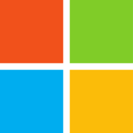

如果您觉得这个项目对您有帮助，就请点右上角的**Star**按钮为它加星星✨✨ 其他TIOBE Top 20编程语言的中文翻译请看[awesome-code-resources](https://github.com/awesome-code-resources/awesome-code-resources)。
# Awesome VBA
Visual Basic for Applications (VBA) 是Microsoft的事件驱动编程语言Visual Basic 6.0 (VB6) 的实现，内置于大多数桌面Microsoft Office应用程序中。
这是VBA和vb6的库和资源的精选列表。
## 符号体系
由于VBA的性质，许多库不适用于所有操作系统，所有Office应用程序或所有体系结构 (x64/x86)。一些库还可能需要外部资源 (DLL，插件等)，由于VBA缺乏包管理器，这些资源很难使用。为了帮助您找到适合您需求的项目，这个Awesome 列表使用以下符号。符号体系还具有可提供更多信息的工具提示。
#### 平台兼容性
* -在所有平台上兼容
* -Mac兼容
* -Windows兼容
#### 应用程序兼容性
* -所有应用程序
* -Word
* -Excel
* -访问
* -Outlook
* -PowerPoint
* -杂项应用程序-(ms-project，AutoCAD等)-在简短描述中指定
#### 其他重要信息
* -仅32位
* -用VBA编写，但代码受密码保护
* -需要外部依赖，例如,,等。
* -需要安装
* -链接包括/导致付费内容
## 内容
- [Awesome -vba](#Awesome--vba)
  - [符号体系](#符号体系)
  - [平台兼容性](#平台兼容性)
  - [应用程序兼容性](#应用程序兼容性)
  - [其他重要信息](#其他重要信息)
  - [内容](#内容)
  - [框架](#框架)
  - [库](#库)
  - [数据格式](#数据格式)
  - [JSON](#JSON)
  - [CSV](#CSV)
  - [XML](#XML)
  - [数据结构](#数据结构)
  - [阵列列表](#阵列列表)
  - [词典](#词典)
  - [数学库](#数学库)
  - [数据库工具](#数据库工具)
  - [用户窗体工具](#用户窗体工具)
  - [低级工具](#低级工具)
  - [解析器/解释器](#解析器/解释器)
  - [Web工具](#Web工具)
  - [开发人员工具](#开发人员工具)
  - [杂项](#杂项)
  - [示例](#示例)
  - [算法、代码优化和性能测试](#算法、代码优化和性能测试)
  - [UI功能区](#UI功能区)
  - [UI用户窗体](#UI用户窗体)
  - [低级别的例子](#低级别的例子)
  - [插件](#插件)
  - [游戏/有趣的项目](#游戏/有趣的项目)
  - [外部工具](#外部工具)
  - [样式参考线](#样式参考线)
  - [信息](#信息)
  - [资源](#资源)
  - [Win32-API资源](#Win32-API资源)
  - [VB6-/-VBScript](#VB6-/-VBScript)
  - [网站](#网站)
  - [图书](#图书)
  - [Youtube](#Youtube)
  - [论坛](#论坛)
  - [贡献](#贡献)
## 框架
* [stdVBA](http://github.com/sancarn/stdVBA)-一个包含大量自动化和实用程序类的框架。注重代码的紧凑性和长期可维护性。
* [VbCorLib](https://github.com/kellyethridge/VBCorLib)-一个框架，带来了许多强大的。NET类到VBA/vb6。
* [Hidennotare](https://github.com/RelaxTools/Hidennotare)-日本作家RelaxTools的框架。包含许多类、接口和表单。
## 库
### 数据格式
#### JSON
* [VBA-JSON](https://github.com/VBA-tools/VBA-JSON)-JSON转换和解析。
* [mdJSON](https://www.vbforums.com/showthread.php?871695-VB6-VBA-JSON-parsing-to-built-in-VBA-Collections-with-JSON-Path-support)-带有点符号的JSON库，用于提取路径。
* [JSONBag](https://www.vbforums.com/showthread.php?738845-VB6-JsonBag-Another-JSON-Parser-Generator)-使用shebang表示法从JSON字符串中提取键。也可以用这个库构建JSON。
#### CSV
* [VBA-CSV-interface](https://github.com/ws-garcia/VBA-CSV-interface)-功能强大，快速和全面的RFC-4180兼容CSV/TSV/DSV数据管理库。
* 从框架:
  * 在查找和。
#### XML
* [VBA-XML](https://github.com/VBA-tools/VBA-XML)-XML转换和解析。
#### 邮编
* [Excel-ZipTools](https://github.com/cristianbuse/Excel-ZipTools/tree/master)-解析和读取Zip文件。
### 数据结构
#### 阵列列表
* [Better array](https://github.com/Senipah/VBA-Better-Array/tree/master/src)-一个数组类提供更现代的语言中发现的功能。
* 从框架:
  * 在查找-如上。
  * 在查找-如上。还包括搜索数组或从回调执行检查的方法。
#### 词典
* [VBA-Dictionary](https://github.com/VBA-tools/VBA-Dictionary)-存储键值对的字典对象。
* [VBA-ExtendedDictionary](https://github.com/SSlinky/VBA-ExtendedDictionary)-使用Scripting.dictionary的Dictionary对象，但公开了一些额外的有用功能。
* [cHashList](https://www.vbforums.com/showthread.php?834515-Simple-and-fast-lightweight-HashList-Class-(no-APIs))-简单，快速和轻量级的HashList类，不使用Win32 API。但是需要字符串键。
* [CollectionEx](https://www.vbforums.com/showthread.php?834579-Wrapper-for-VB6-Collections)-使用检索和检查密钥存在的方法扩展默认VBA(/VB6) 集合。
* [clsTrickHashTable](https://www.vbforums.com/showthread.php?788247-VB6-Hash-table)-使用在运行时注入的机器代码的哈希表。完全替换脚本字典，具有奖金功能。
* 从框架:
  * 在查找-如上。
  <!-- Hidennotare, though it simply wraps Scripting.Dictioanry... -->
### 数学库
* [VBA-Math-Objects](https://github.com/Beakerboy/VBA-Math-Objects)-矩阵和向量库。
* [VBA Float](https://github.com/ws-garcia/VBA-float)-一个实用程序来执行大整数和有理数与数千位的计算。
### 数据库工具
* [SQL Library](https://github.com/Beakerboy/VBA-SQL-Library)-用于psql，mssql，mysql数据库的OOP SQL库。
### 用户窗体工具
* [Task Dialog](https://github.com/fafalone/cTaskDialog64)-来自这个1类的大量UI功能，以严格的动态和模块化方式。伟大的数据输入表单。另请参见[vbforums](https://www.vbforums.com/showthread.php?777021-VB6-TaskDialogIndirect-Complete-class-implementation-of-Vista-Task-Dialogs)post以获取更多信息。
* [Material UI](https://github.com/todar/VBA-Material-Design)-让你的userform感觉现代与材料UI。
* [Easy EventListener](https://github.com/todar/VBA-Userform-EventListener)-将userform的所有事件处理合并到1个回调中。
* [Pseudo Control Arrays](http://addinbox.sakura.ne.jp/Breakthrough_P-Ctrl_Arrays_Eng.htm)-整合userform的所有事件处理的最佳方法。演示的用法API.也值得一看[this class](https://stackoverflow.com/questions/61855925/reducing-withevent-declarations-and-subs-with-vba-and-activex#answer-61893857)我也是.
* [Modern UI Components](https://github.com/krishKM/Modern-UI-Components-for-VBA)-自定义现代的控件。
* [MVVM](https://github.com/rubberduck-vba/MVVM)-模型-视图-用于可维护的userform开发的ViewModel基础结构。
* [VBA Userform Transitions and Animations](https://github.com/todar/VBA-Userform-Animations)-一个很好的库，用于将动画easings实现到用户窗体中。
* [Trick's Timer](https://github.com/thetrik/VbTrickTimer)-如果您需要连续运行一段代码并且无法访问(和/或您需要以每秒一次的速度运行它)，这是适合您的类!也看看[forum post](https://www.vbforums.com/showthread.php?875635-VB6-VBA-Timer-class)了解更多信息。
* [Drag and Drop filepaths](https://www.mrexcel.com/board/threads/vba-drag-drop-filepath.843330/page-6#post-5898495)-允许您的用户表单处理拖放文件。
* [Late-bound WebBrowser Control Events](https://www.vbforums.com/showthread.php?847773-VB6-elevated-IE-Control-usage-with-HTML5-elements-and-COM-Event-connectors)-一种以后期绑定方式锁定WebBrowser事件的技术。
* [Mark's userform tools](https://www.kubiszyn.co.uk/)-许多UI工具和漂亮的用户表单。
* [VBA-UserForm-MouseScroll](https://github.com/cristianbuse/VBA-UserForm-MouseScroll)-允许鼠标滚轮在MSForms控件和Userforms上滚动。
* [MSForms (All VBA) Treeview Control](https://jkp-ads.com/Articles/treeview.asp)-由JKP和Peter Thornton完全在VBA中编码的treeview控件替换。
* [Custom Userform TitleBar color](https://www.mrexcel.com/board/threads/using-winapi-to-change-the-color-on-the-title-bar-of-a-userform.1205894/page-2#post-5892050)
* [Multi-color ListBox class](https://www.mrexcel.com/board/threads/multicolor-drag-n-drop-listbox-class-win32.1206334/)
* [Use of GDIPlus in VBA](https://arkham46.developpez.com/articles/office/clgdiplus/)-GDIPlus可以用来创建一个像可以绘制任何图像的元素。另外看看这个[GDI32](https://arkham46.developpez.com/articles/office/clgdi32/)来自同一作者的类。
* [Use of OpenGL in VBA](https://arkham46.developpez.com/articles/office/vbaopengl/?page=Page_1)-OpenGL是一个跨语言，跨平台的应用程序编程接口，用于渲染2D和3D矢量图形。在本文中，GDIPlus类的作者。
* [VB6 Graph Control](https://vb6awards.blogspot.com/2017/11/vb6-graph-control.html)-不会在VBA中本地工作，没有兼容的替代品，但一个非常高性能的图形控制无论。
### 低级工具
* [VBA-MemoryTools](https://github.com/cristianbuse/VBA-MemoryTools)-提供了一个超快速，复制内存的选择。
* [Safe Subclassing](https://www.mrexcel.com/board/threads/intercepting-resetting-of-vba-editor-as-well-as-unhandled-errors-for-safe-subclassing.1024295/)-提供子类化Excel/Word/PowerPoint窗口或用户表单以执行进一步自动化的能力。在后面的线程中，还有一个示例，用于从其他应用程序子类化其他窗口。
* [Calling private module functions](https://codereview.stackexchange.com/questions/274532/low-level-vba-hacking-making-private-functions-public)
* [Universal DLL Calls](http://www.vbforums.com/showthread.php?781595-VB6-Call-Functions-By-Pointer-(Universall-DLL-Calls))-一个库，可用于调用任何函数指针，DLL或对象的函数和。
* [VBA state-loss callback](https://github.com/cristianbuse/VBA-StateLossCallback)-用于VBA状态损失的无故障检测器。状态丢失可能发生在以下情况: 有人点击在未处理的错误中，单击VBA停止按钮; 进入设计模式; 应用程序退出。
* [vb2clr](https://github.com/jet2jet/vb2clr)-使用C # 从VBA使用.NET CLR运行时。
* 从框架:
  * 在查找-COM自动化的一站式商店，从通过偏移量调用接口到提取类型信息。
### 解析器/解释器
* [VbPeg](https://github.com/wqweto/VbPeg)-VBA的解析器生成器。转换PEG语法，如[this](https://github.com/wqweto/VbPeg/blob/master/test/Runner/peg/Kscope/grammar.peg)进入[VBA code like this](https://github.com/wqweto/VbPeg/blob/master/test/Runner/peg/Kscope/cKscope.cls)。如果您在VBA中实现新的编程语言，则非常有用。Wqweto还包括一些数学表达式解析器作为测试。
* [Volpi's Math Expression Parser](https://web.archive.org/web/20100703220609/http://digilander.libero.it/foxes/mathparser/MathExpressionsParser.htm)-一个快速的数学表达式解析器。不允许调用对象，没有调用堆栈。
* [VBA Expressions](https://github.com/ws-garcia/VBA-Expressions)-一个强大的字符串表达式计算器专注于数学和数据处理。
* [ClooWrapperVBA](https://github.com/Excel-lent/ClooWrapperVBA)-使用GPU或CPU从VBA执行OpenCL。
* 从框架:
  * 在查找-完整的编程语言，包括对象操作，调用堆栈等。
### Web工具
* [VBA-Web](https://github.com/VBA-tools/VBA-Web)-将适用于Windows和Mac的VBA，Excel，Access和Office连接到web服务和web
* [VBA-WebSocket](https://github.com/EagleAglow/vba-websocket)-用于WebSocket客户端的Microsoft示例代码，可以与echo服务器结合使用。也有[a class](https://github.com/EagleAglow/vba-websocket-class)和一个[async version](https://github.com/EagleAglow/vba-websocket-async)由microsoft代码的发现者生成。
* [vbAsyncSocket](https://github.com/wqweto/VbAsyncSocket)-基于MFC中的原始CAsyncSocket包装的VB6的简单和瘦WinSock API包装。
* [Edge Automation](https://www.codeproject.com/Tips/5307593/Automate-Chrome-Edge-using-VBA)-使用devtools协议自动执行Chromium边缘。[Github backup here](https://github.com/sancarn/stdVBA-Inspiration/tree/master/ChromeEdgeAutomation)
* [Chrome Automation (via devtools protocol)](https://github.com/PerditionC/VBAChromeDevProtocol)-使用Chrome devtools协议自动化chrome。
* [webxcel](https://github.com/michaelneu/webxcel)-运行RESTful后端的web服务器。造物主还做了一个[article](https://dev.to/michaelneu/to-vba-and-beyond---building-a-restful-backend-using-plain-microsoft-excel-macros-76n)关于它是如何工作的dev.to.
## 开发人员工具
* [Rubberduck](https://rubberduckvba.com/)-与Visual Basic编辑器集成的开源COM外接程序项目，可将现代功能添加到熟悉的IDE中。工作在VBA6，VBA7.x (x86/x64)，是的，在VB6太!
* [VBA-IDE-Code-Export](https://github.com/spences10/VBA-IDE-Code-Export)-Addin包含用于git (或任何VCS) 的代码导入器和导出器。
* -[RibbonX](https://www.andypope.info/vba/ribboneditor_2010.htm)-AndyPope的可视化功能区编辑器。
* [Custom UI XML Editor](https://yoursumbuddy.com/ribbon-customui-xml-editor/)-用于直接添加，编辑和验证功能区XML的插件 (Excel 2010)。
* [MZ-Tools](https://www.mztools.com/)-VBE addin提供开发工具
* [VbPeg](https://github.com/wqweto/VbPeg)-VBA的解析器生成器。转换PEG语法，如[this](https://github.com/wqweto/VbPeg/blob/master/test/Runner/peg/Kscope/grammar.peg)进入[VBA code like this](https://github.com/wqweto/VbPeg/blob/master/test/Runner/peg/Kscope/cKscope.cls)。如果您在VBA中实现新的编程语言，则非常有用。
* [VBA Resource File Editor](http://leandroascierto.com/blog/vba-resource-file-editor/)-将其他文件存储在excel/word/powerpoint文件中，以便以后使用此方便的工具。
* [vbRichClient](https://vbrichclient.com/#/en/About/)-一个充满有用库的外部客户端
* [vbWatchDog](https://www.everythingaccess.com/vbwatchdog.asp)-破解VBA运行时以提供发生错误的模块名称，过程名称和行号。
## 杂项
* [Excel Name Manager](https://jkp-ads.com/excel-name-manager.asp)-由JKP和Peter Thornton完全在VBA中编码的treeview控件替换。
* [Excel Flex Find](https://jkp-ads.com/excel-flexfind.asp)-由JKP和Peter Thornton完全在VBA中编码的treeview控件替换。
## 示例
### 算法、代码优化和性能测试
* [VBSpeed](http://www.xbeat.net/vbspeed/)-Visual Basic性能站点-专注于VB6，但可转移到VBA。
### UI功能区
* [Ron de Bruin - Ribbons/QAT](https://www.rondebruin.nl/win/section2.htm)-有关开发自定义功能区和上下文菜单的信息/示例的领先资源。
* [Office MSO Icons](http://www.spreadsheet1.com/office-excel-ribbon-imagemso-icons-gallery-page-01.html)-功能区图标通常可以使用1500之一 (本网站上3页) MSO图标wich预先存在于Office应用程序中。
### UI用户窗体
* [Drag and drop control](https://www.vbforums.com/showthread.php?888843-Load-image-into-STATIC-control-Win32&p=5496575&viewfull=1#post5496575)-在用户窗体周围拖放图像控件。
### 低级别的例子
* [Iterating the ROT](https://www.mrexcel.com/board/threads/how-to-target-instances-of-excel.1118789/page-2#post-5395037)-迭代ROT以查找Excel工作簿实例的示例。
* [Iterating Excel Instances via IAccessible](https://www.mrexcel.com/board/threads/how-to-target-instances-of-excel.1118789/page-2#post-5395519)-在某些情况下，Excel实例未注册到ROT。然而，Excel应用程序实现,它不仅可以用于使UI自动化，还可以用于从hwnd获取Excel实例。
<!-- ### VBE UI -->
### 插件
* [MenuRighter](https://yoursumbuddy.com/blog/menurighter/)-MenuRighter是一个Excel插件，可让您修改右键菜单。您可以添加几乎在其他右键菜单或Excel 2003的 “经典” 菜单中找到的任何控件。
* [Sam Rad's DatePicker](http://samradapps.com/datepicker/)-视觉上令人印象深刻和专业的DatePicker addin for Excel。仅工作表/不能与userforms一起使用。
### 游戏/有趣的项目
* [xlStudio](https://github.com/DylanTallchiefGit/xlStudio)-Microsoft Excel的DAW。还检查了Awesome [video](https://youtu.be/RFdCM2kHL64)。
* [Cellivization](https://s0lly.itch.io/cellivization)-在Excel中创建的酷炫的类似RTS的游戏。还检查了Awesome [video](https://www.youtube.com/watch?v=PzETBRcr_i8)。
* [Arkanoid](http://leandroascierto.com/blog/juego-arkanoid-en-excel/)-Arkanoid，复古的街机游戏，内置在Excel中。在某些机器上，它比其他机器运行得更快。
* [Battleships](https://github.com/rubberduck-vba/Battleship)
* [Pacman](https://arkham46.developpez.com/articles/office/clgdiplus/tuto/tutoclgdiplusgame3/?page=Page_11#LXXIV)
* [ExcelCommodroid](https://github.com/raspberrypioneer/ExcelCommodroid/tree/main)-在Windows上使用MS Excel的Commodore计算机加载程序。仅限VBA7。
## 外部工具
* [oletools](https://github.com/decalage2/oletools)-Python工具，可用于解码VBA P代码 (VBA的中间语言)。
* [twinBasic](https://twinbasic.com/)-一个VBA兼容的解析器，评估器和编译器。
## 样式参考线
* [RubberDuck's style guide](https://rubberduckvba.wordpress.com/2021/05/29/rubberduck-style-guide/)-有一些很棒的中级-高级指导。
* [VB6 Coding conventions](https://docs.microsoft.com/en-us/previous-versions/visualstudio/visual-basic-6/aa240822(v%3dvs.60))-VBA中使用的变量/类/模块命名约定。极大地帮助组织在VBE (除非你有rubberduck)。
## 信息
* [Thunder - The birth of Visual Basic](http://www.forestmoon.com/birthofvb/birthofvb.html)-关于VB7/VBA诞生的小文章。
* [My First Bill Gates Review](https://www.joelonsoftware.com/2006/06/16/my-first-billg-review/)-Joel Spolsky，Excel团队的项目经理，讲述了他的第一次Bill Gates评论。Joel添加了许多功能，例如,,和。它还讨论了从Lotus 123移植到Excel的可怕的日期错误。
* [Ruby, EB and DLL composition](https://github.com/sancarn/stdVBA-Inspiration/blob/master/_OtherDocumentation/VBA%20and%20VB6%20History%20-%20Eb%20and%20Ruby/VBA%20History.md)-翻译副本[VBStreets article](http://bbs.vbstreets.ru/viewtopic.php?f=101&t=56551)由俄罗斯VBer创建。在该语言的历史中详细介绍了VB6和VBA dll的组成。
* [PCode Internals](https://www.vbforums.com/showthread.php?884919-pcode-internals)-VBA编译为PCode。理解较低级别的P代码是一个非常有趣和研究的主题。
* [How many lines of code in EB](http://bbs.vbstreets.ru/viewtopic.php?f=101&t=56633)-未翻译的文章由俄罗斯VBer它估计VB6/VBA中的代码行数。
* [SAFEARRAYS](https://www.vbforums.com/showthread.php?895566-RESOLVED-SAFEARRAY-Structure-for-an-Array)-数组的内部结构。
* [Articles by Sancarn](https://sancarn.github.io/vba-articles)-Sancarn撰写的有关VBA的各种文章，包括性能，VBA的实际问题等。
## 资源
### Win32 API资源
* [JKP API Declarations](https://jkp-ads.com/Articles/apideclarations.asp)
* [Microsoft Office Code Compatibility Inspector](https://docs.microsoft.com/en-us/previous-versions/office/office-2010/ee833946(v=office.14))-Microsoft Office代码兼容性检查器由Microsoft设计，用于解决将Office从32位升级到64位时与VBA代码的兼容性问题。尽管显然可以在internet上找到该软件的版本，但MS尚未维护该软件的链接以从其服务器下载。
### VB6 / VBScript
* [Planet Source Code](https://github.com/Planet-Source-Code/PSCIndex)-Github之前的原始Github是Github。现在在Github上可用。可能不是以前在PSC网站上提供的项目/源代码的整个集合 (？)，尽管对于更多的人来说肯定绰绰有余，并且在星期五晚上让自己开心。
* [vbAccelerator Archive](https://github.com/tannerhelland/vbAccelerator-Archive)-vbAccelerator网站的存档副本 (文章，源代码等) 2015年消失，2018年重新出现，任何人都猜猜接下来会发生什么...主要是VB6，但有用的VBA资源。
### 网站
* [Excel Development Platform Blog](https://exceldevelopmentplatform.blogspot.com/)-博客处理高级主题/VBA。
* [MSDN VBA Documentation](https://msdn.microsoft.com/en-us/vba/office-vba-reference)
* [MS-VBAL Language Spec](https://docs.microsoft.com/en-gb/openspecs/microsoft_general_purpose_programming_languages/ms-vbal/d5418146-0bd2-45eb-9c7a-fd9502722c74)
* [Ron de Bruin](https://www.rondebruin.nl/index.htm)-简单-中级主题。
* [Bytecomb VBA Reference](https://bytecomb.com/vba-reference/)-中级-高级主题。
* [Chip Pearson's website](http://www.cpearson.com/excel)-初学者的好资源-中级。
* [VBA for smarties](http://www.snb-vba.eu/inhoud_en.html)-对许多数据结构和机制的很好的参考。
* [Automate Excel's cheat sheets](https://www.automateexcel.com/vba/cheatsheets/)
* [Rubberduck Blog](https://rubberduckvba.wordpress.com/)-中级-高级主题。
* [Slipstick](https://www.slipstick.com/)-Diane Poremsky (MVP) 的网站，专注于Outlook和VBA。
* [TechnicLee](https://techniclee.wordpress.com/)-Outlook博客，许多示例包括根据用户请求的代码变体。
* [PowerPoint VBA](https://pptvba.com/)-一个致力于通过在PowerPoint中制作游戏来教授VBA的网站。
* [MS KB Archive](https://github.com/jeffpar/kbarchive/tree/master/id/vbwin)-vb6/vba问题，解决方案和教程的大量存档。
### 图书
* [Hard Core Visual Basic](https://classicvb.net/hardweb/mckinney.htm)-Visual Basic新5.0版本的高级程序员指南。包括一组核心的实用程序，快捷方式和问题解决方案，以实现广泛的功能程序。硬书也存在。还检查了[Comments and corrections](https://jeffpar.github.io/kbarchive/kb/173/Q173840/)。
* [The VBA Developer's Handbook](https://www.academia.edu/29801473/VBA_Developers_Handbook_Second_Edition)-为任何情况编写防弹VBA代码。对于使用 “Visual Basic for Applications” 编程语言的300多种产品的开发人员来说，本书是必不可少的资源。其他地方也有精装本。
* [Advanced Visual Basic 6](https://pdfcoffee.com/advanced-visual-basic-6-power-techniques-for-everyday-programs978020170712024922-pdf-free.html)-日常程序的功率技术Matthew Curland。其他地方也有精装本。
* [Professional Excel Development](https://oiipdf.com/download/professional-excel-development-the-definitive-guide-to-developing-applications-using-microsoft-excel-vba-and-net)-在这本书中，四个世界级的微软®Excel开发人员为使用Excel构建功能强大、健壮且安全的应用程序提供了从头到尾的指导。也提供精装本。
* [Excel VBA Programming For Dummies](https://www.google.com/search?q=Excel+VBA+Programming+For+Dummies+book)-是时候移动到一个新的水平-使用Visual Basic for Applications (VBA) 创建自己的自定义Excel 2010解决方案。使用分步说明和可访问的，友好的傻瓜风格，这本实用的书向您展示了如何使用VBA，编写宏，自定义您的Excel应用，以您想要的方式查看和工作，避免错误等
* [Power Programming with VBA](https://www.wiley.com/en-us/Excel+2019+Power+Programming+with+VBA-p-9781119514916)-使用VBA进行Excel 2019电源编程已完全更新，以涵盖Excel 2019的所有最新工具和技巧。包括对Excel应用程序开发的分析和对Visual Basic for Applications (VBA) 的完整介绍，这本综合的书介绍了开发大型和小型Excel应用程序所需的所有技术。
* [(E-Book) VBA beginners](https://goalkicker.com/VBABook/)
* [(E-Book) Excel VBA beginners](https://goalkicker.com/ExcelVBABook/)
### YouTube
* [Excel Macro Mastery](https://www.youtube.com/c/Excelmacromastery)-保罗·凯利 (MVP) - excelmacromastery.com.
* [Sigma Coding](https://www.youtube.com/c/SigmaCoding)-教程的大目录-从初学者到高级。深入研究其他内容创建者未探索的VBA有趣领域。
* [WiseOwl's VBA tutorials](https://www.youtube.com/playlist?list=PLNIs-AWhQzckr8Dgmgb3akx_gFMnpxTN5)-伟大的全面的VBA资源。为初学者提供完美的介绍。深入学习VBA的各个方面。巨大的播放列表，涵盖了大多数类型的VBA。
* [VBA A2Z](https://www.youtube.com/c/VBAA2Z)-许多教程，一些付费内容。好数组的有趣和不同的主题-深入的教程到VBA的不同部分，与一些。NET/VSTO视频。强烈关注UI开发。
* [Excel VBA Is Fun](https://www.youtube.com/c/ExcelVbaIsFun)
* [Excel for Freelancers](https://www.youtube.com/c/ExcelForFreelancers)-动手教程，从开始到结束开发特定的应用程序。所有级别。
* [Leila Gharani](https://www.youtube.com/c/LeilaGharani)-办公室范围内的焦点-对初学者有用。
* [Get to know VBA](https://youtu.be/MFR_XARJjoY)-使用VBA呈现和创建的一些出色的应用程序。
### 论坛
* [Reddit](http://reddit.co.uk/r/vba)-每日VBA问答。偶尔的专业提示共享和显示和告诉库出版。
* [StackOverflow](https://stackoverflow.com/questions/tagged/vba)一个伟大的地方问问题。重复的问题被标记为重复，并将作者发送到正确的位置。
* [Chandoo](https://chandoo.org/wp/)-Chandoo论坛-Purna Duggirala (MVP) 的博客。非常活跃。
* [Visual Basic Discord](https://discord.gg/gpcSue9f)-VB.NET/VBA/VB6狂热者的聊天室。
* [Excel Discord](https://discord.gg/PU2vVDeb)-Discord服务器由Tim Heng (Excel MVP) 主持，专注于帮助Excel用户。
* [MrExcel](https://www.mrexcel.com/board/)-主要是Excel通用，但很多VBA内容也可以在这里找到。
* [Excel Forum](https://www.excelforum.com/)
* [Slipstick](https://www.forums.slipstick.com)-Diane Poremsky (MVP) 的Slipstick网站 (Outlook VBA) 的优秀论坛。黛安反应很快，她的回答非常有帮助。
* [VBForums - Office Development](https://www.vbforums.com/forumdisplay.php?37-Office-Development)-论坛，重点是VB6/.NET与VBA部分。
## 贡献
您的贡献总是受欢迎的!请看一下[contribution guidelines](./Contributing.md)首先。
